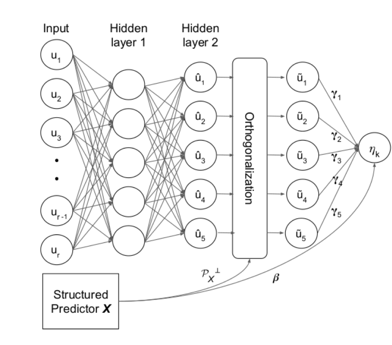
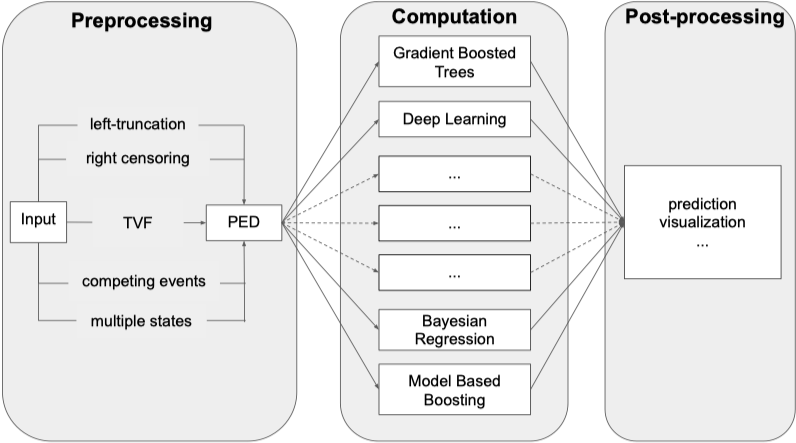
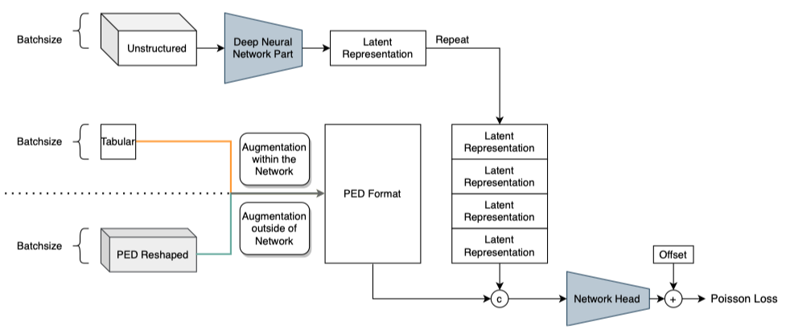

```{r setup, include=FALSE}
# This chunk is not visible in the presentation
# Use it to set up misc. options for your code/output

# knitr chunk options for all chunks
knitr::opts_chunk$set(
  echo = TRUE,          # Set FALSE to hide R code
  messages = FALSE,
  warning = FALSE,      # Don't show warnings from R code
  cache = TRUE,
  dev = "ragg_png",     # Higher quality png graphics device
  fig.align = "center", # Centered plots (recommended)
  fig.retina = 2        # Higher image quality for high resolution screens
)

# xaringanExtra features, see https://pkg.garrickadenbuie.com/xaringanExtra/
# remotes::install_github("gadenbuie/xaringanExtra")
xaringanExtra::use_xaringan_extra(
  c("tile_view", "panelset", "clipboard", "fit_screen")
)

# remotes::install_github("davidruegamer/deepregression")
```

class: middle, inverse
# Introduction

---
## Interpretability & Flexibility: Choose One

.pull-left[
- Linear Models: 
    - Interpretable 🚀  
    - Flexible 😐
]

--

.pull-right[
- Generalized Linear Model: 
    - Interpretable 🚀  
    - Flexible 🙂
]

--

.pull-left[
- Generalized Additive Model: 
    - Interpretable 🚀 
    - Flexible 😊
]

--

.pull-right[
- Neural Networks: 
    - Interpretable 🧐 
    - Flexible 🚀🚀🚀
]

--

![:vspace 5]

.center[How about the best of both worlds?]


---
class: middle, inverse
# SDDR

---
## Model Overview

A distribution $\mathcal{D}$ with $K$ parameters $\theta_k$:  
$\mathcal{D}(\theta_1, \ldots, \theta_K) \quad \theta_k \equiv \theta_k(\eta_k), \ \ k = 1, \ldots, K$

--

Additive predictors $\eta_k$, each consisting of  
structured **linear**, **smooth**, or additional **unstructured** effects of predictors $\boldsymbol{x}, \boldsymbol{z}, \boldsymbol{u}$

--

$$\eta_k \equiv \eta_k(\boldsymbol{x}, \boldsymbol{z}, \boldsymbol{u}) = \underbrace{\boldsymbol{x}^\top \boldsymbol{w}}_{\text{Linear effects}} + 
\underbrace{\sum_{j=1}^J f_{k,j}(\boldsymbol{z})}_{\text{Smooth effects (Splines)}} + 
\underbrace{\sum_{l=1}^L d_{k,l}(\boldsymbol{u})}_{\text{Unstructured effects (DNN)}}$$

--

All transformations:  

$$(\boldsymbol{x}, \boldsymbol{z}, \boldsymbol{u}) \longrightarrow \eta_k(\boldsymbol{x}, \boldsymbol{z}, \boldsymbol{u}) \xrightarrow{h_k} \theta_k(\eta_k) \longrightarrow \mathcal{D}(\theta_1, \ldots, \theta_k, \ldots, \theta_k)$$

---
## Motivation

### Foundations

- **Distributional Regression (DR)** models all parameters of a distribution

- Counter-example: LM, GLM, GAM etc. only model the distribution **mean** $\mu = \mathbf{E}(Y \ |\ X)$

- **Structured Additive Distributional Regression (SADR)** extend GAMs with DR

- This work: **Semi-Structured Deep Distributional Regression (SDDR)** extends SADR

---
## Motivation

### Interpretability

Previous approaches (e.g. Deep GLM) encompass identifiability issue:

--

.pull-left[

\begin{align}
& \boldsymbol{\nu}^\top\boldsymbol{w} + d(\boldsymbol{\nu}) =& \\
& \boldsymbol{\nu}^\top\boldsymbol{w} + \boldsymbol{\nu}^\top\boldsymbol{m} + f(\boldsymbol{\nu}) =& \\
& \boldsymbol{\nu}^\top\boldsymbol{m} + \tilde{d}(\boldsymbol{\nu})
\end{align}

]

.pull-right[
Linear portions of $\boldsymbol{\nu}$ can be added / removed arbitrarily between linear part of the predictor and the unstructured predictor $d(\cdot)$
]

--

![:vspace 5]

.center[
$\rightarrow$ Irrelevant for prediction, but relevant for interpretation!
]

---
## Orthogonolization

SDDR proposes solution to this problem: The Orthogonolization Cell

.pull-left[

```{r echo=FALSE, out.width="90%"}

```

]

.pull-right[

> *Visualization of the orthogonalization operation*:  

> Latent features $z$ learned in a neural network with two hidden layers are orthogonalized by the defined structured network part before being added to form 
transformed distribution parameter.

.footnote[Rügamer et al. 2021, Figure 5, p. 11]

]

---
background-image: url(img/sddr-arch.png)
background-size: contain
background-position: left
class: nologo

.pull-right[
### Example Architecture

- Both structured predictors $\boldsymbol{x}$ and structured non-linear predictors $\boldsymbol{z}$ are embedded within a DNN

- Unstructured predictors $\boldsymbol{u}$ are modeled in parallel

- Orthogonolization cell allows identifiability of structured effects

- $\eta$ represents the final additive predictor

.footnote[Rügamer et al. 2021, Figure 1, p. 4]
]

---
class:
## Implementations

![:vspace 15]

- `R`: [davidruegamer/deepregression](https://github.com/davidruegamer/deepregression)

- `Python`: [HelmholtzAI-Consultants-Munich/PySDDR](https://github.com/HelmholtzAI-Consultants-Munich/PySDDR)


---
class: middle, inverse
# DeepPAM

---

## Piecewise Additive Models

- Extension of Piecewise Exponential Models (Friedman 1982)

--

- Allow modeling of survival outcomes within the GAM framework

--

- Basic idea: Equivalence of Poisson Regression and CoxPH (with assumptions)  
  Gain flexibility exceeding the Cox model

--

- Procedure:
    1. Transform time to event data into intervals at chosen split points
    2. Count observed events within these intervals $\rightarrow$ Poisson problem
    3. Maximize Poisson likelihood with algorithm of choice   
    (e.g. GAM, Boosting, Neural Network...)

--

R implementation for data transformation and analysis tasks: [`{pammtools}`](https://adibender.github.io/pammtools/)

---
## Survival Data Format

```{r, echo=FALSE}
library(pammtools)
```

```{r}
tumor |> head(5) |> knitr::kable()
```


---
## PED Format

```{r}
tumor |> 
  as_ped(Surv(days, status) ~ age + sex + transfusion, cut = c(0, 500, 1000)) |> 
  head(5) |> knitr::kable()
```

.font90[
$\rightarrow$ `gam(ped_status ~ s(tend) + age *...,
    family = "poisson", offset = offset)`
]
---

## PAM Overview

.pull-left[

```{r echo=FALSE, out.height="75%"}

```

.footnote[Bender et al. (2021, Fig. 1)]
]

.pull-right[
- Flexible settings through appropriate preprocessing

- Splitting at observed event times default recommendation

- Assumes piece-wise constant hazards within intervals
]

---
## DeepPAM: SDDR + PAM

- 1) PEM: Convert survival task to Poisson task, gain flexible choice of algorithm

--

- 2) PAM: Expand PEM to GAM framework, gain flexible effects 
    
--

- 3) SDDR: Extend GAM framework with Deep Learning, gain ability to handle unstructured data

--

- 4) DeepPAM = SDDR + PAM
  - (Pre-) Convert data to PED format
  - Maximize Poisson likelihood with Deep Learning
  - Incorporate unstructured data (e.g. images, text)
  - Retain identifiability of effects

---
## DeepPAM Architecture

```{r echo=FALSE, out.width="97%"}

```

.footnote[Kopper et al. (2021, Fig. 1)]

---
class: middle, inverse
# Outlook

---
## Outlook

- Research still relatively early

--

- Challenge: Lack of large / diverse multimodal survival datasets for testing

--

- Current results indicate no strong performance benefit over alternative methods on real data 

--

- ...But results on simulated data are promising w.r.t further development

--

![:vspace 10]

.center[.font120[Lots to try with many possible applications!]]

---
## Literature

.font70[
1. Rügamer D, Kolb C, Klein N.  
**Semi-Structured Deep Distributional Regression: Combining Structured Additive Models and Deep Learning**.  
arXiv:200205777. Published online February 8, 2021. http://arxiv.org/abs/2002.05777

1. Bender, A., Groll, A. & Scheipl, F. **A generalized additive model approach to time-to-event analysis**. Statistical Modelling 18, 299–321 (2018).  

1. Bender, A., Rügamer, D., Scheipl, F. & Bischl, B. **A General Machine Learning Framework for Survival Analysis**. arXiv:2006.15442 [cs, stat] 12459, 158–173 (2021).

1. Friedman, M. **Piecewise Exponential Models for Survival Data with Covariates**. The Annals of Statistics 10, 101–113 (1982).

1. Kopper P, Pölsterl S, Wachinger C, Bischl B, Bender A, Rügamer D.  
**Semi-Structured Deep Piecewise Exponential Models**.  
arXiv:201105824. Published online March 1, 2021. http://arxiv.org/abs/2011.05824

]


---
class: center, middle, thanks
background-image: none

## Thank you for your attention

`r rmarkdown::metadata$slides`

.pull-left[.right[
.font150[**Contact**]  
.bipsblue[`r rmarkdown::metadata$contactauthor`]  
Leibniz Institute for Prevention Research and Epidemiology - BIPS GmbH  
Achterstraße 30  
D-28359 Germany  
.bipsblue[`r rmarkdown::metadata$contactemail`]
]]
.pull-right[

```{r, echo = FALSE, out.width = "50%"}
knitr::include_graphics("bips-logo.png")
```

]
