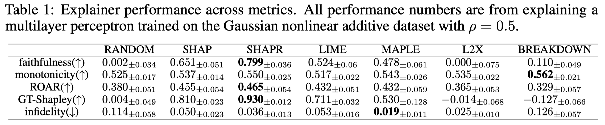
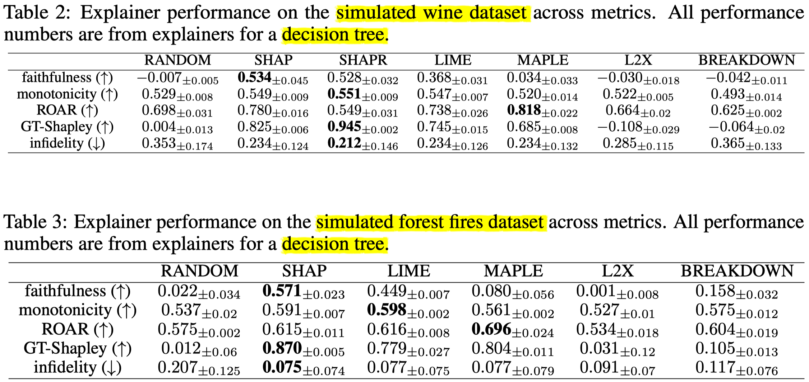

```{r setup, include=FALSE}
knitr::opts_chunk$set(
  echo = FALSE,
  warning = FALSE,
  message = FALSE,
  dev = "ragg_png",
  dev.args = list(background = "transparent"),
  fig.align = "center",
  fig.retina = 2,
  fig.height = 5,
  fig.width = 7,
  cache = FALSE
)

# remotes::install_github("gadenbuie/xaringanthemer")
library(xaringanthemer)
style_mono_accent(  
  base_color = "#006633",
  background_color = "#FAF9F9",
  header_font_google = google_font("Lato"),
  text_font_google   = google_font("Source Sans Pro", "400", "400i"),
  code_font_google   = google_font("Fira Mono"),
  header_color = lighten_color("#006633", strength = .2),
  link_color = lighten_color("#006633", strength = .2),
  base_font_size = "23px",
  
  black_color = "#0A0A0A",
  white_color = "#FAFAFA",
  code_font_size = "0.8rem", # Default is 0.9rem
  # Experimental LMU logo stuff, it's hard
  title_slide_background_image = "lmu-black.png",
  title_slide_background_position = "bottom -200px right -200px",
  title_slide_background_size = "40%"
  #background_image = "lmu-gray.png",
  # background_position = "bottom -250px right -250px",
  # background_size = "40%"
)

# xaringanExtra features, see https://pkg.garrickadenbuie.com/xaringanExtra/
xaringanExtra::use_xaringan_extra(
  c("tile_view", "panelset")
)

theme_local <- function(...) {
  theme_xaringan() +
  theme(
    axis.line = element_line(color = "#0A0A0A"),
    panel.background = element_rect(fill = "transparent"), # transparent panel bg
    plot.background = element_rect(fill = "transparent", color = NA), # transparent plot bg
    panel.grid.major = element_blank(), # remove major gridlines
    panel.grid.minor = element_blank(), # remove minor gridlines
    legend.background = element_rect(fill = "transparent"), # transparent legend bg
    legend.box.background = element_rect(fill = "transparent"), # transparent legend panel
    ...
  )
}

```

background-image: url(img/20220215162228-bv1ke.png)

---
class: middle
## Motivation

- No widely adopted methods to compare/evaluate feature attribution methods

--

- Proposed methods often computationally prohibitive or require strong assumptions

--

- Example: Comparing to ground-truth Shapley values

--

**Goal**:  
Fast development of feature attribution methods as a precursor for human trials

---
## What's Inside the Tin

```{r echo=FALSE, out.height="50%"}

```

---
class: middle, inverse
# Feature Attribution Evaluation Metrics

---
class: middle
## Metrics Overview

- **Faithfulness**

- **Monotonicity**

- **ROAR** ('Remove and retrain')

- **GT-Shapley**: Pearson correlation between $\boldsymbol{w}$ and ground-truth Shapley values

- **Infidelity**

---
class: middle
## Setup

- Datapoints of the form $(\boldsymbol{x}, y) \sim \mathcal{D}$

- Feature attribution method $g(\boldsymbol{x}, f)$ 

  - Generates weights $\boldsymbol{w}$ from $\boldsymbol{x}$ and model $f$

- Features $i \in S \subseteq \{1, \ldots, D\}$

- Conditional pdf $x' \sim \mathcal{D}$, such that $x'_i = x_i$ for all $i \in S$

  - $\Rightarrow \mathcal{D}(x_\emptyset) = \mathcal{D}$
  - $\Rightarrow$ If $F = \{1, \ldots, D\}$, then $x' \sim \mathcal{D}(\boldsymbol{x}_F)$ is equal to $\boldsymbol{x}$ with probability 1

---
class: middle
## Faithfulness

- Pearson correlation between weight vector $\boldsymbol{w}$ and approximate marginal contribution for each feature $i$

--

> "a lightweight metric that is especially useful for comparing which feature would have the most impact on the model output when individually changed."

--

$$\text{faithfulness} = \text{Pearson}\left(
  \left|
    \mathbb{E}_{\boldsymbol{x}' \sim \mathcal{D}(\boldsymbol{x}_{F \setminus i})}
    [f(\boldsymbol{x}') - f(\boldsymbol{x})]
  \right|_{1 \leq i \leq D}, [w_i]_{1 \leq i \leq D}
\right)$$

---
class: middle
## Monotonicity

> "[...] computes the marginal improvement of each feature ordered by the weight vector w **without replacement**, [...]"

--

- Fraction of indices $i$ such that the marginal improvement for feature $i$ is greater than marginal improvement of feature $i+1$

--

> "[...] useful when comparing the effect of features as they are added sequentially."

--

- $S^+(\boldsymbol{w}, i)$: Set of $i$ most important weights

$$\text{monotonicity} = \frac{1}{D - 1} \sum_{i = 0}^{D-2} \mathbb{I}_{|\delta_i^+| \leq |\delta_{i+1}^+|}$$

$$\delta^+_i = \mathbb{E}_{\boldsymbol{x'} \sim \mathcal{D} \left( \boldsymbol{x}_{S^+(\boldsymbol{w}, i+1)} \right)}
 [f(\boldsymbol{x'})] -
 \mathbb{E}_{\boldsymbol{x'} \sim \mathcal{D} \left( \boldsymbol{x}_{S^+(\boldsymbol{w}, i)} \right)}
 [f(\boldsymbol{x'})]$$

---
class: middle
## ROAR (Remove and Retrain)

- Issue: Comparing marginal improvement requires evaluation $f$ on different combinations of features, could be unstable for lack of data points in training data

- ROAR: Alternative paradigm proposed by [Hooker (2018) *A benchmark for interpretability methods in deep neural networks*](https://arxiv.org/pdf/1806.10758.pdf)

--

- Retrain model with new dataset $(= f^*)$ with features (with highest weight) removed, then evaluate

$$|f^*(\mathbb{E}_{\boldsymbol{x}' \sim \mathcal{D}(\boldsymbol{x}_{F\setminus i})}) [\boldsymbol{x'}]) - f(\boldsymbol{x}) |$$

--

- Plot performance of $f^*$ against number of removed features

  - Compare steepness of plots
  
  - Calculate AUC statistic (used in this paper)


---
class: middle
## GT-Shapley


- Pearson correlation of $\boldsymbol{w}$ and ground-truth Shapley values

--

### Caveat

--

The bit about knowing "ground-truth Shapley values"


---
class: middle
## Infidelity

> "[...] computed by considering the effects of replacing each feature with a *noisy* baseline conditional expectation."

--

- Computes difference between change in $f()$ and dot-product of change in feature value and $\boldsymbol{w}$, in expectation over the noise

--

- Would be similar to faithfulness if noise was only added one feature at a time

--

> "[...] can pick up nonlinear trends in feature importances better than faithfulness or monotonicity."

---
## Choosing Metrics

- **ROAR**, **GT-Shapley**: Expensive

--

- **Faithfulness**: Iteratively removing most important features _with replacement_   
  - Q: Which individual features would change output most if removed?
  - Less suitable if features are correlated

--

- **Monotonicity**: Removing features _without replacement_
  - Q: Effect of cumulatively adding features
  - Better if correlated features are present

--

- **Infidelity**: 
    - Considers ablations of subsets of features instead of individual features
    - More appropriate for highly nonlinear feature interactions

---
class: middle, inverse
# Synthetic Datasets

---
class: middle
## Motivation

- In real data, $\mathcal{D}(\boldsymbol{x}_S)$ can only be approximated

- Approximation can be very poor for low-density regions
  
- $\Rightarrow$ Synthetic datasets have known conditional distributions

---
class: middle
## Synthetic Data Generation

- Two steps: Label $y = h(\boldsymbol{x})$, feature vector $\boldsymbol{x}$

- Included feature distributions: Multivariate Gaussian, Gaussian mixtures, multinomial

- Label distributions: Linear, piece-wise constant, nonliniear additive, piecewise linear

- Labels are normalized to zero mean and unit variance, so featureless learner has MSE of 1

- Datasets can be parameterized, e.g. through $\rho$ to control global feature dependence in Gaussian case

---
class: middle, inverse
# Experiments

---
class: middle
## Setup

- 8 methods: SHAP, SHAPR, BF-SHAP, LIME, MAPLE, L2X, breakDown, (baseline RANDOM)

- 5 evaluation metrics

- Experiments run by varying 1 or 2 dimensions in (metric, model, (dataset, ML model))

---
class: middle
## Results: Performance across metrics

```{r, out.width = "90%"}

```

- SHAPR best, MAPLE most consistent
- breakDOWN well suited for monotonicity metric

---
class: middle
## Results: Across datasets


```{r, out.width = "85%"}

```


- LIME fails for highly correlated features

- BF-SHAP assumes independence

- MAPLE once again consistent

---
class: middle
## Results: Across ML models


```{r, out.width = "85%"}

```


- Explainer performance drops with higher correlations

- MAPLE doesn't like trees

---
class: middle
## Simulating real datasets

- Two real-world datasets (wine quality, forest fires)
  
  - Real features, labels: $\boldsymbol{x}_\text{real}$, $y_\text{real}$
  
  - Synthetic $\boldsymbol{x}_\text{sim}$ generated via multiv. Gaussian based on empirical covariance matrix
  
  - $y_\text{sim}$ labelled via kNN
  
- Evaluate simulation quality via Jensen-Shannon-DIvergence (JSD)

  - $\mathrm{JSD} \in [0, 1]$, the lower value = higher similarity
  
  - For wine dataset: ~0.2 for features/labels each, "good fit"

---
class: middle
## Results: Simulated real datasets


```{r, out.width = "100%"}

```

---
class: middle, inverse
# Conclusions & Limitations

---
## Conclusions & Limitations

--

> Despite the fact that the synthetic datasets aim to cover a broad range of feature distributions [...], **there is almost certainly a gap between synthetic and real-world datasets**

--

Like categorical features.

--

> Hence there is a trade-off between data realism and ground truth availability.

Fair enough.

--

> Note that our library is **not meant to be a replacement for human interpretability studies**. Since the goals of explainability methods are inherently human-centric, **the only foolproof method of evaluating explanation methods are to use human trials**.

--

> [...] we recommend developing new explainability methods in this library, and then conducting human trials on real data.

---
class: middle
## Links

.font200[
- Paper: https://arxiv.org/abs/2106.12543

- Code: https://github.com/abacusai/xai-bench
]
