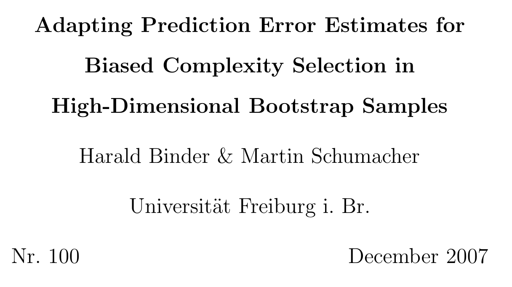

```{r setup, include=FALSE}
knitr::opts_chunk$set(
  echo = FALSE, 
  message = FALSE,
  fig.height = 4.2,
  fig.width = 7,
  out.width = "95%"
)
```

## Introduction

Simulation setup part of ongoing project

### Motivation

- Variable selection in high-dimensional settings with competing risks
- Focus more on high-dimensional setting than sophisticated survival outcome

### Outcome
- 2 competing events, censoring approx. equal prevalence

## Generating Survival Times (I)

```{r}

```

@binder2009boostinghighdimensional

## Generating Survival Times (II)

```{r}

```

@binder2008adaptingprediction

## Generating Survival Times (III)

```{r}

```

@bender2005generatingsurvival

## Predictors: Structure

- $N = 400$, $p = 5000$, 16 informative (12 per event)
- Organized in 4 blocks á 250 correlated variables + uncorrelated noise

### Blocks

- Block 1: $\rho \approx 0.5$
- Block 2: $\rho \approx 0.35$
- Block 3: $\rho \approx 0.05$
- Block 4: $\rho \approx 0.32$
- Rest: $\rho \approx 0$

## Predictors: Generation

- $j = 1, \ldots, p$ and $i = 1, \ldots, N$
- $\epsilon_{ij} \sim \mathcal{N}(0, 1)$ and $u_{i\{1,2,3\}} \sim \mathcal{U}(0, 1)$

$$
x_{ij} = \begin{cases}
-1 + \epsilon_{ij}                                   & \text{for}\ i \leq 0.5n \text{ and } j \leq 0.05p \\
1 + \epsilon_{ij}                                    & \text{for}\ i > 0.5n \text{ and } j \leq 0.05p \\
1.5 \cdot \mathbf{1}\{u_{i1} < 0.4\} + \epsilon_{ij} & \text{for}\ 0.05p < j \leq 0.1p \\
0.5 \cdot \mathbf{1}\{u_{i2} < 0.7\} + \epsilon_{ij} & \text{for}\ 0.1p < j \leq 0.2p \\
1.5 \cdot \mathbf{1}\{u_{i3} < 0.3\} + \epsilon_{ij} & \text{for}\ 0.2p < j \leq 0.3p \\
\epsilon_{ij}                                        & \text{for}\ j > 0.3p
\end{cases}
$$


## Effect Assignment

- Cause-specific hazards for events $k = 1,2$ and coefficients $\pmb{\beta}^{(k)}$
- $\beta^{(k)}_j = \pm 0.5$ for effect variables

<!-- ($j =    1, \ldots,  250$) -->
<!-- ($j =  251, \ldots,  500$) -->
<!-- ($j =  501, \ldots, 1000$) -->
<!-- ($j = 1001, \ldots, 5000$) -->

- Block 1 (**Mutual**): 4 effect variables
    - same effect on both $\pmb{\beta}^{(1,2)}$ cause-specific hazards
- Block 2 (**Reversed**): 4 effect variables
    - positive effect in $\pmb{\beta}^{(1)}$ and negative in $\pmb{\beta}^{(2)}$
- Block 3 (**Disjoint**): 8 variables
    - 3.1: 4 effect variables in $\pmb{\beta}^{(1)}$ only
    - 3.2: 4 effect variables $\pmb{\beta}^{(2)}$ only

## Event and Censoring Times (I)

- Cox-exponential model for events $k = 1,2$
- $\lambda_{1,2,C}$: Baseline hazards for event times $T_i^{(k)}$, and censoring times $C_i$
- Simple setting: $\lambda_1 = \lambda_2 = \lambda_C = 0.1$


\begin{align*}
T_i^{(k)} &= \frac{-\log(U_i)}{\lambda_k \exp(\mathbf{x}^{T}_i\pmb{\beta}^{(k)})} \\
C_i       &= \frac{-\log(U_i)}{\lambda_C}
\end{align*}


$$U_i \sim \mathcal{U}(0, 1) \Rightarrow -\log(U_i) \sim \mathrm{Exponential}(\lambda = 1)$$


## Event and Censoring Times (II)

Assign observed event times $t_i$ and censoring $\delta_i$ indicator accordingly


\begin{align*}
t_i &= \min(T_i^{(1)}, T_i^{(2)}, C_i) & 
\delta_i &= \begin{cases}
  0 & \text{if}\ t_i = C_i \\
  1 & \text{if}\ t_i = T_i^{(1)} \\
  2 & \text{if}\ t_i = T_i^{(2)} \\
  \end{cases}
\end{align*}

## Resulting Outcome

<!-- ### Coefficient vectors -->

- $\pmb{\beta}^{(k)}$ sparse with 12 non-zero entries, $\sum_{i = 1}^p \beta^{(k)}_j = 2$

<!-- ### Hazards -->

- $\exp(\mathbf{x}^{T}_i\pmb{\beta}^{(k)})$ in range of $[10^{-4}, 10^{3}]$

### Event prevalences

Mean event counts and prevalence after 100 replicates with $N = 400$:

\begin{table}
\centering
\begin{tabular}{l|l|l}
\hline
$\delta$ & $n$ (min - max) & \% (min - max)  \\
\hline
0 & 118.0 (97 - 136) & 29.5\% (24.2\% - 34.0\%)\\
\hline
1 & 165.1 (142 - 190) & 41.3\% (35.5\% - 47.5\%)\\
\hline
2 & 116.9 (93 - 141) & 29.2\% (23.2\% - 35.2\%)\\
\hline
\end{tabular}
\end{table}


## Thanks for listening!

## Buffer Slide

Next up: Implementation details nobody will want to see but I put them on here any _just in case_ anyone asks because I don't have too much else to talk about in this regard sorry Mensa anyone?

## Predictors: Code

```r
  X <- matrix(rnorm(n * p), nrow = n, ncol = p)
  ui1 <- runif(n); ui2 <- runif(n); ui3 <- runif(n)
  j_seq <- seq_len(p)
  block1 <- which(j_seq <= 0.05 * p)
  X[seq_len(n/2), block1] <- -1 + X[seq_len(n/2), block1]
  X[-seq_len(n/2), block1] <- 1 + X[-seq_len(n/2), block1]
  block2 <- which((j_seq > (0.05 * p)) & (j_seq <= (0.1 * p)))
  X[, block2] <- 1.5 * (ui1 < 0.4) + X[, block2]
  block3 <- which((0.1 * p < j_seq) & (j_seq <= 0.2 * p))
  X[, block3] <- 0.5 * (ui2 < 0.7) + X[, block3]
  block4 <- which((0.2 * p < j_seq) & (j_seq <= 0.3 * p))
  X[, block4] <- 1.5 * (ui3 < 0.3) + X[, block4]
```


## Efect Assignment: Code

```r
  ce <- 0.5
  # first block
  j_block1 <- which(j_seq <= 0.05 * p)
  beta1[j_block1[1:4]] <- ce
  beta2[j_block1[1:4]] <- ce
  # second block
  j_block2 <- which((j_seq > (0.05 * p)) & (j_seq <= (0.1 * p)))
  beta1[j_block2[1:4]] <- ce
  beta2[j_block2[1:4]] <- -ce
  # third block
  j_block3 <- which((0.1 * p < j_seq) & (j_seq <= 0.2 * p))
  beta1[j_block3[1:4]] <- -ce
  beta2[j_block3[5:8]] <- ce # offset by 4
```

## Event Times: Code

```r
  lp1 <- X %*% beta1
  lp2 <- X %*% beta2

  Ti1 <- -log(runif(n)) / (lambda1 * exp(lp1))
  Ti2 <- -log(runif(n)) / (lambda2 * exp(lp2))
  Ci <- -log(runif(n)) / lambda_c

  ti <- pmin(Ti1, Ti2, Ci)
  di <- as.integer(Ti1 <= Ci | Ti2 <= Ci)
  di[which(Ti2 <= Ti1 & Ti2 <= Ci)] <- 2
```
